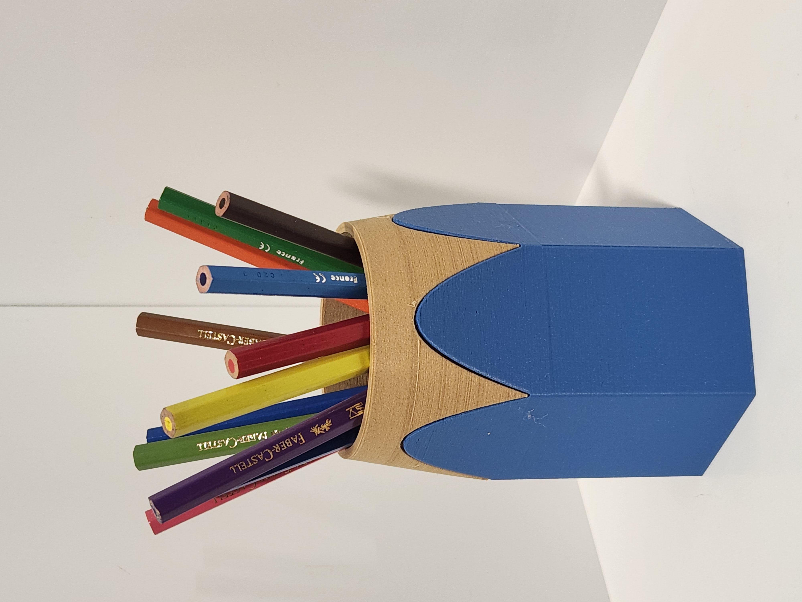

# Multi-Color Pencil Cup, two-part remix

[![CC BY 4.0][cc-by-shield]][cc-by]

Pencil for pencils! A realistically-looking pencil-cup,
especially if printed using wood filament.

Adaptation of the original 
[Multi-Color Pencil Cup](https://www.thingiverse.com/thing:2536528)
model, with following changes:

* Changed the way parts of the model are connected: they fit one into the other,
so it can be printed in two parts, and no gluing is required.
* Reduced bottom thickness, so that it could be printed without infill.
* Converted to OpenSCAD format, making it customizable.

## Variants

The model comes in two variants:

* pencil-cup-v1, with larger "wooden" part and smaller "color" part,
with the inner part completely "wooden", and a thin "color" shell wrapping it;
* pencil-cup-v2, with larger "color" part and smaller "wooden" part, with "wooden"
top fittin on top of the "color" bottom.

Both models look identical from the outside. You may choose one or the other
depending on which filament you prefer to save.

## Print settings

* 0.2mm is recommended
* no support required
* no infill required (can be set to 0%, making it hollow)

## Attribution and License

This work, is adapted from
[Multi-Color Pencil Cup](https://www.thingiverse.com/thing:2536528)
by [Mosaic Manufacturing](https://www.mosaicmfg.com/),
used under [CC BY 4.0][cc-by].

Licensed under [CC BY 4.0][cc-by] by [David Avsajanishvili](https://davidavs.com).

[cc-by]: http://creativecommons.org/licenses/by/4.0/
[cc-by-image]: https://i.creativecommons.org/l/by/4.0/88x31.png
[cc-by-shield]: https://img.shields.io/badge/License-CC%20BY%204.0-lightgrey.svg
